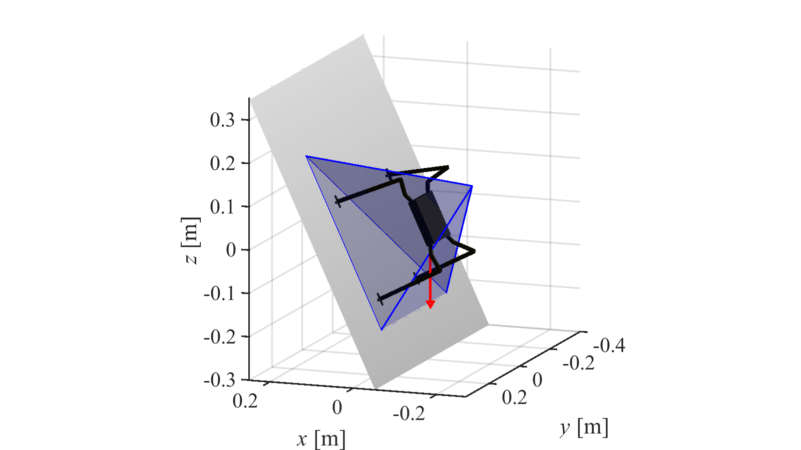

# README - equ_gia

This README describes basic information on Gravito-inertial Acceleration (GIA) stability polyhedron code for MATLAB.

### What is this repository for? ###

* This is the repository for development and version control of a equilibrium check for climbing robots based on the GIA stability polyhedron: a method being developed by the Space Robotics Laboratory at Tohoku University.

### How do I get set up? ###

* Download the files from this repository
* Open MATLAB (the code was developed in MATLAB 2019a. It might not run properly in older versions)
* Add the folder `equ_gia` to your workspace.
* Run the file `\eg\test_example_robot.m` and and check if you can see the result image.
  * This example requires the [SpaceDyn toolbox](http://www.astro.mech.tohoku.ac.jp/spacedyn/index.html) (already included in the `\lib` folder). 

* If you want to test your own parameters, include the function `equ_gia_polyhedron_calc()` in your code, or use your parameters as input for this function. 
  * Type `help equ_gia_polyhedron_calc` in the MATLAB Command Window for more details.

### NOTICE ###

* This is a free software. You can download and use it freely for your academic purpose.
* There is no warranty for any damages caused by this software.
* If you want to use and/or cite this software, please refer to the following proceedings paper:

Warley F. R. Ribeiro, Kentaro Uno, Kenji Nagaoka, and Kazuya Yoshida, "Dynamic Equilibrium of Climbing Robots Based on Stability Polyhedron for Gravito-Inertial Acceleration", *The 23rd International Conference on Climbing and Walking Robots and the Support Technologies for Mobile Machines*, Moscow, Russia, 2020 (accepted).

### Who do I talk to? ###

Have any problem, question or suggestion? Please contact us!

* Repository admin: Warley Ribeiro (warley at dc.tohoku.ac.jp)
